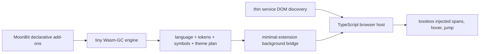

# Web Highlighter

**Web Highlighter is not a syntax-highlighting library.** It is a browser-side language-support injection layer for GitHub, GitLab, Discord, Slack, ChatGPT, and other pages that are unlikely to support your private, experimental, composite, or simply overlooked language upstream.

When a service renders an `mbtx`, `ush`, `tnix`, or brand-new language as plain text, the extension detects that code, asks a tiny MoonBit/Wasm-GC engine for semantic spans and same-file symbols, then patches only the existing code nodes. The page stays in control of layout, selection, copying, and line anchors.

The product is deliberately opinionated:

- language detection, declarative grammars, tokenization, symbols, and themes live in MoonBit;
- TypeScript is only the WebExtension and DOM boundary;
- add-ons are immutable build-time data, never downloaded executable code;
- unknown, ambiguous, oversized, or unsupported input is left untouched;
- no source code leaves the browser.

## What works

- Manifest V3 builds for Chromium browsers, Firefox, and Safari Web Extensions.
- GitHub and GitLab blob lines with their native `LC…` nodes preserved, plus lexical hover and same-file jump-to-definition.
- Discord, Slack, ChatGPT, and ordinary `pre > code` blocks, including fenced aliases.
- Explicit aliases, filename extensions, special filenames, and conservative weighted inference when a service discards language metadata.
- Declarative MoonBit language and theme add-ons without TextMate/tmLanguage repositories, regex callbacks, `eval`, or remote code.
- Idempotent SPA updates with strict per-pass and per-surface limits.

## Built-in injected support

The requested languages ship in the Wasm catalog:

- Idris 2 (`idris`, `idris2`, `.idr`, `.lidr`, `.ipkg`)
- MoonBit and MoonBit Executable (`moonbit`, `mbt`, `mbtx`, `.mbt`, `.mbtx`)
- [mizchi/vibe-lang](https://github.com/mizchi/vibe-lang) (`vibe`, `.vibe`)
- [ubugeeei-prod/tnix](https://github.com/ubugeeei-prod/tnix) (`tnix`, `.tnix`)
- [ubugeeei-prod/ush](https://github.com/ubugeeei-prod/ush) (`ush`, `.ush`)
- [ubugeeei-prod/vapor-moon](https://github.com/ubugeeei-prod/vapor-moon) (`mbtv`, `.mbtv`)

Mojo, Gleam, Roc, Typst, Nushell, Lean 4, Koka, Nickel, Pkl, and Uiua are also built in. The selection is a curated response to recurring hosted-service gaps, not a popularity ranking; see [the research snapshot](docs/research.md).

## Size and speed

The release engine is a dependency-free Wasm-GC module. A local Apple-silicon run in the pinned Nix environment measured:

| Signal                          |   Measured |        CI budget |
| ------------------------------- | ---------: | ---------------: |
| Content host + analyzer, Brotli |   14.7 KiB |   at most 32 KiB |
| Wasm instantiate + first scan   |     1.6 ms |   at most 100 ms |
| Repeated 512 KiB MoonBit scan   | 17.1 MiB/s | at least 2 MiB/s |

These are reproducible budget signals, not universal hardware claims. Run `vp run bench` for the current machine.

## Development

The Nix flake pins MoonBit CLI `0.1.20260713` with compiler `0.10.4`, Vite+ `0.2.4`, pnpm `11.9.0`, and Node.js `24.16.0`.

```sh
nix develop
vp install --frozen-lockfile
vp run verify
```

All project operations are exposed through `vp`:

```sh
vp check         # Oxfmt, Oxlint, and strict TypeScript checking
vp test --run    # DOM and distribution tests
vp build         # MoonBit Wasm-GC + all unpacked WebExtensions
vp run firefox-lint # Mozilla submission validation
vp run bench     # measured runtime budgets
vp run package   # reproducible store/source ZIP archives and SHA256SUMS
vp run verify    # MoonBit checks/tests + all checks above
```

Load `dist/chromium`, temporarily install `dist/firefox/manifest.json`, or package `dist/safari` with `xcrun safari-web-extension-packager`. The listed services receive automatic access. Any other origin is requested explicitly from the popup.

## A declarative language add-on

An add-on is ordinary MoonBit data exported from a normal package. It describes facts; it does not supply a tokenizer callback:

```moonbit
pub fn contribution() -> @web.Addon {
  @web.addon(
    languages=[
      @web.make_language(
        "my-lang",
        "My Language",
        ["myl"],
        ["myl"],
        [],
        [@web.signature("effect ", 2), @web.signature("module my.lang", 3)],
        "effect else fn if let match module return type",
        "Bool Int List Result String",
        "true false none",
        [("fn", @web.FunctionSymbol), ("type", @web.TypeSymbol)],
        ["//"],
        [@web.delimiter("/*", "*/")],
        [@web.quoted("\"")],
        "+-*/=<>!&|",
        "$",
      ),
    ],
    themes=[],
  )
}
```

The package imports the core as `@web`; the thin analyzer entrypoint imports selected add-on packages and lists their contributions in `configured_addons`. A theme uses the equally declarative `theme(...)` constructor and stable semantic roles. See [Writing add-ons](docs/plugins.md).

## Architecture



The Wasm engine never sees a DOM. It runs in the extension origin because that is the reliable Manifest V3 context for packaged Wasm-GC; the content host reaches it through a minimal message bridge. The browser host never contains language vocabulary or theme policy. Service discovery never parses source. This separation keeps syntax growth out of the extension shell and confines service DOM breakage to one small boundary.

Read [Architecture](docs/architecture.md) and [Service adapters](docs/services.md) for invariants and failure behavior.

## Honest navigation boundary

This is not an LSP hidden in every chat message. Declaration introducers such as `fn`, `type`, and `let` produce lexical symbols; references jump to the first same-surface definition. There is no claim of type-aware overload resolution, macro expansion, scope-perfect shadowing, or cross-repository navigation.

## Releases

Change `package.json` and `moon.mod` to the same new semantic version in a conventional pull request. After that pull request passes CI and merges, run **Actions → Release → Run workflow** on `main` (or `gh workflow run release.yml --ref main`). The workflow re-verifies the exact `main` commit, waits for approval in the protected `release` environment, creates an annotated tag, emits GitHub OIDC build-provenance attestations, and publishes the browser archives in a GitHub Release.

For the first release, a clean, synchronized local `main` can bootstrap the same tag-triggered workflow:

```sh
vp run release minor
```

The local task bumps both version files, runs the complete verification suite, creates a conventional release commit and annotated tag, then atomically pushes `main` and the tag. Both entry points create the GitHub Release without reading store credentials. Firefox and Edge credentials are isolated in the separately approved `store-publish` environment; Chrome uses short-lived OIDC instead.

Store submissions use the canonical [listing copy](store/listing.md), [reviewer notes](store/reviewer-notes.md), and [privacy policy](PRIVACY.md). The [store publishing guide](docs/store-publishing.md) covers the protected workflow and each one-time account setup.

## License

MIT
