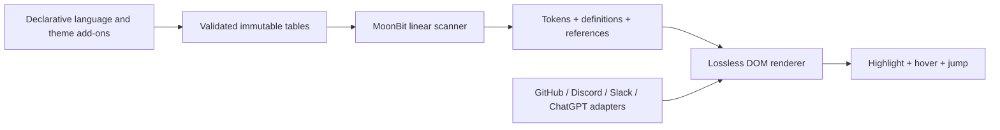

# Web Highlighter

The tiny browser extension for languages the web forgot.

Web Highlighter restores syntax highlighting on GitHub, Discord, Slack, ChatGPT, and arbitrary websites. It is built for experimental, personal, and newly released languages that cannot wait for every hosted service to add first-class support.

The analysis engine is written in MoonBit and compiled to a dependency-free JavaScript module. Language and theme add-ons are declarative TypeScript values validated at build time—no TextMate grammar, no runtime regex callbacks, no remote code, and no page data leaving the browser.

## What works today

- Manifest V3 distributions for Chrome, Edge, Brave, Firefox, and Safari Web Extensions.
- GitHub files and diffs, including same-file jump-to-definition and hover cards.
- Discord, Slack, ChatGPT, and ordinary fenced code blocks.
- Build-time language and theme add-ons through a typed declarative API.
- A single MoonBit scan that emits semantic tokens, definitions, and references.
- SPA-safe, idempotent DOM updates with the original source retained verbatim.
- Hard CI budgets for compressed size, cold start, and scanner throughput.

Current measured release bundle on Apple silicon:

| Signal | Result | CI budget |
|---|---:|---:|
| Content runtime, Brotli | about 12 KiB | at most 32 KiB |
| Cold analyzer start | about 1 ms | at most 100 ms |
| 512 KiB repeated scan | about 6 MiB/s | at least 2 MiB/s on hosted CI |

Run `npm run bench` for measurements on your machine. These are deliberately checked as budgets rather than presented as universal hardware-independent claims.

## Built-in languages

The requested project languages are all included:

- Idris 2 (`idris`, `idris2`, `.idr`)
- MoonBit and MoonBit Executable (`moonbit`, `mbt`, `mbtx`, `.mbt`, `.mbtx`)
- [mizchi/vibe-lang](https://github.com/mizchi/vibe-lang) (`vibe`, `.vibe`)
- [ubugeeei-prod/tnix](https://github.com/ubugeeei-prod/tnix) (`tnix`, `.tnix`)
- [ubugeeei-prod/ush](https://github.com/ubugeeei-prod/ush) (`ush`, `.ush`)
- [ubugeeei-prod/vapor-moon](https://github.com/ubugeeei-prod/vapor-moon) (`mbtv`, `.mbtv`)

The first research pass also found recurring gaps across general-purpose highlighters and hosted services, so Mojo, Gleam, Roc, Typst, Nushell, Lean 4, Koka, Nickel, Pkl, and Uiua are built in. See [the research notes](docs/research.md) for selection evidence and limitations.

## Install an unpacked build

Requirements: Node.js 24+, MoonBit, and npm.

```sh
npm ci
npm run verify
```

Then load the appropriate directory:

- Chrome, Edge, or Brave: load `dist/chromium` as an unpacked extension.
- Firefox: use “Load Temporary Add-on” and select `dist/firefox/manifest.json`.
- Safari: run `xcrun safari-web-extension-converter dist/safari`, then build the generated Xcode project.

GitHub, Discord, Slack, and ChatGPT receive automatic access. On another site, click the toolbar button and grant access only to that origin. The extension never requests access to every site at installation time.

## A declarative language add-on

Language modules declare facts; they do not run a tokenizer callback:

```ts
import { defineLanguage, words } from "./extension/src/plugin-api.ts";

export default defineLanguage({
  id: "my-lang",
  name: "My Language",
  aliases: ["myl"],
  extensions: ["myl"],
  signatures: [
    { text: "module my.lang", weight: 3 },
    { text: "effect ", weight: 2 },
  ],
  grammar: {
    keywords: words("effect else fn if let match module return type"),
    types: words("Bool Int List Result String"),
    constants: words("true false none"),
    declarations: {
      fn: "function",
      let: "variable",
      module: "module",
      type: "type",
    },
    lineComments: ["//"],
    blockComments: [{ open: "/*", close: "*/" }],
    strings: [{ open: "\"", close: "\"" }],
  },
});
```

The compiler validates and freezes the definition, sorts lookup tables, and compiles them once into a MoonBit scanner handle. Add the module to `plugins/builtin/catalog.ts` to ship it. The API intentionally has no arbitrary regular expressions or executable matcher callbacks, which keeps performance predictable and Manifest V3 review straightforward.

Read [Writing language and theme add-ons](docs/plugins.md) for the full contract.

## Architecture



The scanner does not know the DOM. Service adapters do not know language syntax. Themes do not trigger reparsing. Navigation is derived from the same spans as highlighting. This boundary is the main reason the runtime stays small and service-specific breakage remains local.

See [Architecture](docs/architecture.md) and [Service adapters](docs/services.md) for invariants and failure behavior.

## Accuracy boundary

Web Highlighter is intentionally a fast lexical and same-file structural layer, not an LSP running inside every chat message. It recognizes declared names and their same-file references. It does not claim type-aware overload resolution, cross-repository references, macro expansion, or compiler-equivalent parsing.

For experimental languages, a small predictable result that never blocks the page is preferable to silently pretending to offer full semantic navigation. A future parser-derived layer can implement the same immutable `Analysis` contract without changing service adapters or rendering.

## Development

```sh
npm run check   # MoonBit release build + deny-warn check + TypeScript strict check
npm test        # MoonBit, DOM, integration, manifest, and coverage tests
npm run build   # Chromium, Firefox, and Safari WebExtension directories
npm run bench   # measured size, startup, and throughput budgets
npm run verify  # all of the above
```

The test suite covers malformed regions, escaped strings, symbol navigation, all built-in languages, detection precedence, GitHub line preservation, Discord/ChatGPT fences, idempotent rendering, manifest contents, remote-code absence, and size budgets.

## License

MIT
