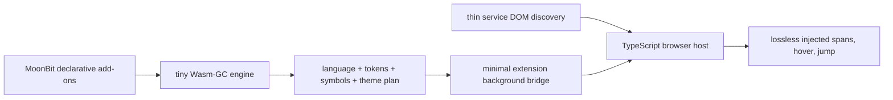

# Web Highlighter

**Web Highlighter is not a syntax-highlighting library.** It is a browser-side language-support injection layer for GitHub, GitLab, Discord, Slack, ChatGPT, and other pages that are unlikely to support your private, experimental, composite, or simply overlooked language upstream.

When a service renders an `mbtx`, `mbti`, `mbtp`, `ush`, `tnix`, or brand-new language as plain text, the extension detects that code, asks a tiny MoonBit/Wasm-GC engine for semantic spans and same-file symbols, then patches only the existing code nodes. The page stays in control of layout, selection, copying, and line anchors.

The product is deliberately opinionated:

- language detection, declarative grammars, compiled lexical indexes, tokenization, symbols, proof contracts, and themes live in MoonBit;
- TypeScript is only the WebExtension and DOM boundary;
- add-ons are immutable build-time data, never downloaded executable code;
- unknown, ambiguous, oversized, or unsupported input is left untouched;
- no source code leaves the browser.

## What works

- Manifest V3 builds for Chromium browsers, Firefox, and Safari Web Extensions.
- GitHub and GitLab blob lines with their native `LC…` nodes preserved, plus lexical hover and same-file jump-to-definition.
- Discord, Slack, ChatGPT, and ordinary `pre > code` blocks, including fenced aliases.
- Explicit aliases, filename extensions, special filenames, and conservative weighted inference when a service discards language metadata.
- Declarative MoonBit language and theme add-ons without TextMate/tmLanguage repositories, regex callbacks, `eval`, or remote code.
- Exact-word function and property vocabularies for small languages whose standard helpers matter as much as reserved words, with validation rejecting empty, duplicated, or cross-scope vocabulary.
- Idempotent SPA updates with strict per-pass browser limits plus MoonBit-owned
  source and output budgets so oversized files remain untouched or partially
  highlighted instead of stalling the page.

## Built-in injected support

The requested languages ship in the Wasm catalog:

- Idris 2 (`idris`, `idris2`, `.idr`, `.lidr`, `.ipkg`)
- MoonBit (`moonbit`, `mbt`, `mbtx`, `mbti`, `mbtp`, `.mbt`, `.mbtx`, `.mbti`, `.mbtp`)
- [mizchi/vibe-lang](https://github.com/mizchi/vibe-lang) (`vibe`, `.vibe`, `.vibex`)
- [ubugeeei-prod/tnix](https://github.com/ubugeeei-prod/tnix) (`tnix`, `.tnix`)
- [ubugeeei-prod/ush](https://github.com/ubugeeei-prod/ush) (`ush`, `.ush`)
- [ubugeeei-prod/vapor-moon](https://github.com/ubugeeei-prod/vapor-moon) (`mbtv`, `.mbtv`)

Mojo, Gleam, Roc, Typst, Nushell, Lean 4, Koka, Nickel, Pkl, and Uiua are also built in. The selection is a curated response to recurring hosted-service gaps, not a popularity ranking; see [the research snapshot](docs/research.md).

## Size and speed

The release engine is a dependency-free Wasm-GC module. A local Apple-silicon run in the pinned Nix environment measured:

| Signal                          |   Measured |        CI budget |
| ------------------------------- | ---------: | ---------------: |
| Content host + analyzer, Brotli |   14.7 KiB |   at most 32 KiB |
| Wasm instantiate + first scan   |     1.6 ms |   at most 100 ms |
| Repeated 512 KiB MoonBit scan   | 17.1 MiB/s | at least 2 MiB/s |

These are reproducible budget signals, not universal hardware claims. Run `vpr bench` for the current machine.

## Development

The Nix flake pins MoonBit CLI `0.1.20260827` with compiler `0.10.11`, Why3 `1.8.2`, CVC5 `1.3.4`, Z3 `4.16.0`, Vite+ `0.3.0`, pnpm `11.9.0`, and Node.js `24.16.0`.

```sh
nix develop
vpr install
vpr verify
```

All project operations are exposed through `vpr`:

```sh
vpr ready        # installs deps, builds, and loads dist/chromium into Chrome
vpr check        # Oxfmt, Oxlint, and strict TypeScript checking
vpr moon-prove   # Formal verification for the proof-enabled MoonBit package
vpr test --run   # DOM and distribution tests
vpr build        # MoonBit Wasm-GC + all unpacked WebExtensions
vpr browser-smoke # launches the unpacked Chromium extension against fixtures
vpr firefox-lint # Mozilla submission validation
vpr bench        # measured runtime budgets
vpr package      # reproducible store/source ZIP archives and SHA256SUMS
vpr verify       # MoonBit checks/tests + all checks above
```

### Documentation site

Docs are built with `@ox-content/vite-plugin@3.0.0-beta.0` and deployed to
Void. The production workflow uses GitHub OIDC, not a long-lived deploy token.

```sh
vpr docs-build
vpr docs-deploy
```

Read [Docs deployment](docs/deployment.md) for Void project variables and the
OIDC workflow shape.

### Chrome local install

```sh
nix develop
vpr ready
```

`vpr ready` builds `dist/chromium` and launches Chrome with an isolated user
cache profile using Manifest V3's unpacked-extension flags. Set
`WEB_HIGHLIGHTER_CHROME_PROFILE` to override that profile location. GitHub,
GitLab, Discord, Slack, ChatGPT, and OpenAI Chat receive automatic host access
from the generated extension. Any other origin is requested explicitly from the
popup.

Firefox can temporarily load `dist/firefox/manifest.json`; Safari uses
`dist/safari` with `xcrun safari-web-extension-packager`.

## A declarative language add-on

An add-on is ordinary MoonBit data exported from a normal package. It describes facts; it does not supply a tokenizer callback:

```moonbit
pub fn contribution() -> @highlight.Addon {
  @highlight.addon(
    languages=[
      @highlight.make_language(
        "my-lang",
        "My Language",
        ["myl"],
        ["myl"],
        [],
        [@highlight.signature("effect ", 2), @highlight.signature("module my.lang", 3)],
        "effect else fn if let match module return type",
        "Bool Int List Result String",
        "true false none",
        [("fn", @highlight.FunctionSymbol), ("type", @highlight.TypeSymbol)],
        ["//"],
        [@highlight.delimiter("/*", "*/")],
        [@highlight.quoted("\"")],
        "+-*/=<>!&|",
        "$",
        functions="print println",
        properties="std",
      ),
    ],
    themes=[],
  )
}
```

For a local language, create a package under `addons/<name>`, import it from
`cmd/analyzer/moon.pkg`, add `@name.contribution()` to `configured_addons` in
`cmd/analyzer/main.mbt`, then run `nix develop -c vpr ready`.

The package imports the core as `@highlight`; the thin analyzer entrypoint imports selected add-on packages and lists their contributions in `configured_addons`. A theme uses the equally declarative `theme(...)` constructor and stable semantic roles. See [Writing add-ons](docs/plugins.md).

## Architecture


```mermaid
flowchart LR
  D["MoonBit declarative add-ons"] --> W["tiny Wasm-GC engine"]
  W --> A["language + tokens + symbols + theme plan"]
  A --> B["minimal extension background bridge"]
  S["thin service DOM discovery"] --> H["TypeScript browser host"]
  B --> H
  H --> P["lossless injected spans, hover, jump"]
```

The Wasm engine never sees a DOM. It runs in the extension origin because that is the reliable Manifest V3 context for packaged Wasm-GC; the content host reaches it through a minimal message bridge. The browser host never contains language vocabulary or theme policy. Service discovery never parses source. This separation keeps syntax growth out of the extension shell and confines service DOM breakage to one small boundary.

Read [Architecture](docs/architecture.md) and [Service adapters](docs/services.md) for invariants and failure behavior.

## Honest navigation boundary

This is not an LSP hidden in every chat message. Declaration introducers such as `fn`, `type`, and `let` produce lexical symbols; references jump to the first same-surface definition. There is no claim of type-aware overload resolution, macro expansion, scope-perfect shadowing, or cross-repository navigation.

## Releases

Change `package.json` and `moon.mod` to the same new semantic version in a conventional pull request. After that pull request passes CI and merges, run **Actions → Release → Run workflow** on `main` (or `gh workflow run release.yml --ref main`). The workflow re-verifies the exact `main` commit, waits for approval in the protected `release` environment, creates an annotated tag, emits GitHub OIDC build-provenance attestations, and publishes the browser archives in a GitHub Release.

For the first release, a clean, synchronized local `main` can bootstrap the same tag-triggered workflow:

```sh
vpr release minor
```

The local task bumps both version files, runs the complete verification suite, creates a conventional release commit and annotated tag, then atomically pushes `main` and the tag. Both entry points create the GitHub Release without reading store credentials. Firefox and Edge credentials are isolated in the separately approved `store-publish` environment; Chrome uses short-lived OIDC instead.

To reconcile an existing release after an interrupted publication, run `gh workflow run release.yml --ref main -f tag=v0.1.0`. The workflow checks out that immutable tag, rebuilds and verifies every archive, and requires an exact byte-for-byte match with the published assets before succeeding.

Store submissions use the canonical [listing copy](store/listing.md), [reviewer notes](store/reviewer-notes.md), and [privacy policy](PRIVACY.md). The [store publishing guide](docs/store-publishing.md) covers the protected workflow and each one-time account setup.

## License

MIT
